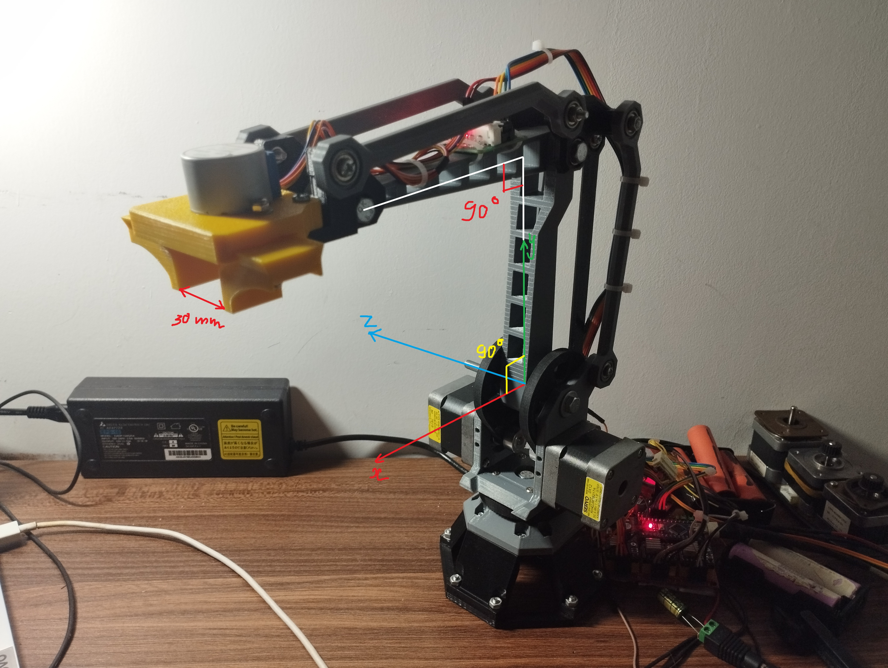
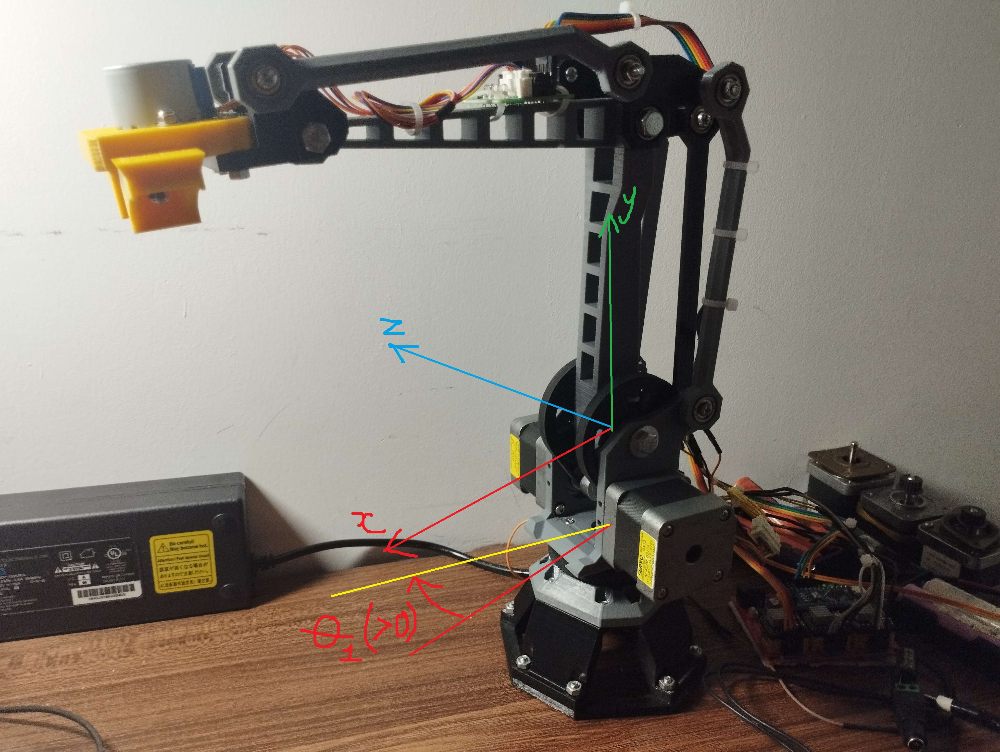
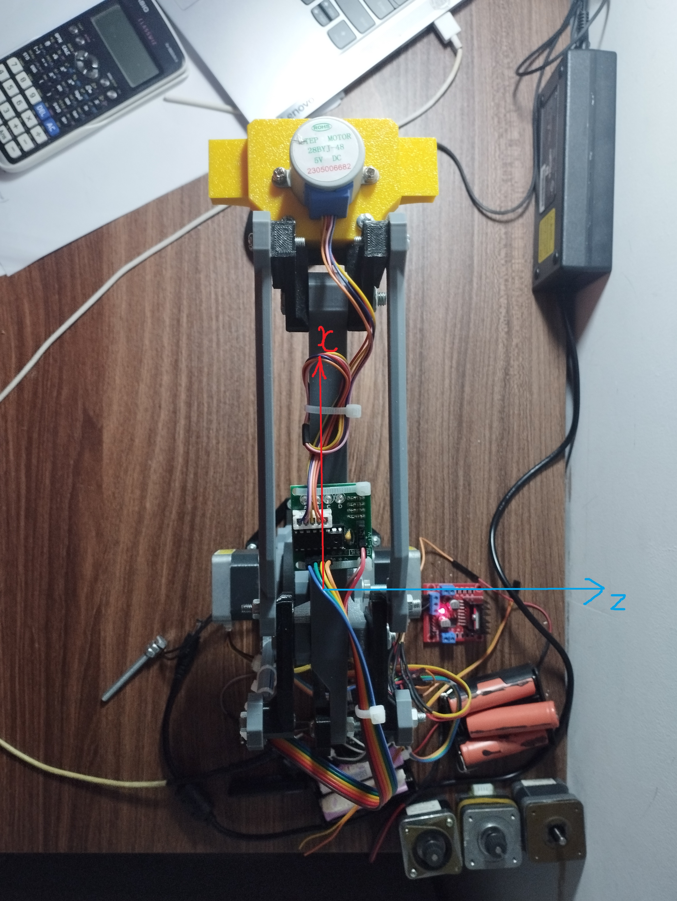
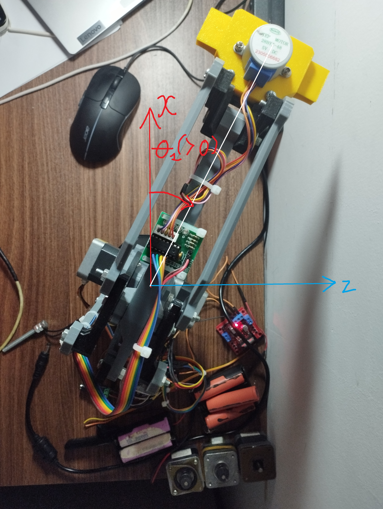
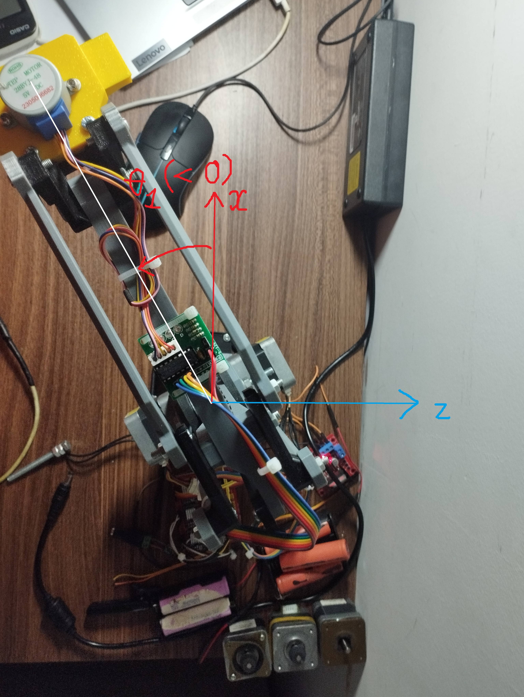
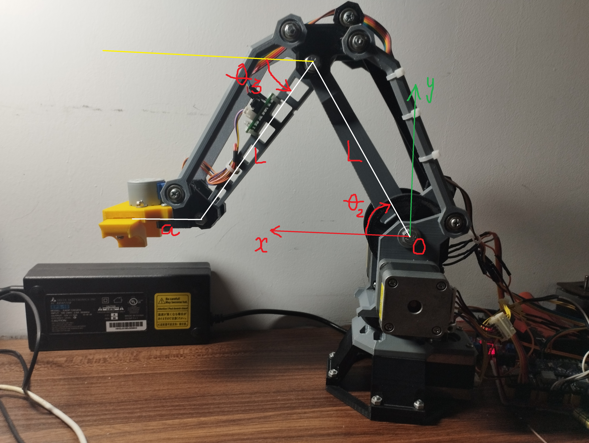
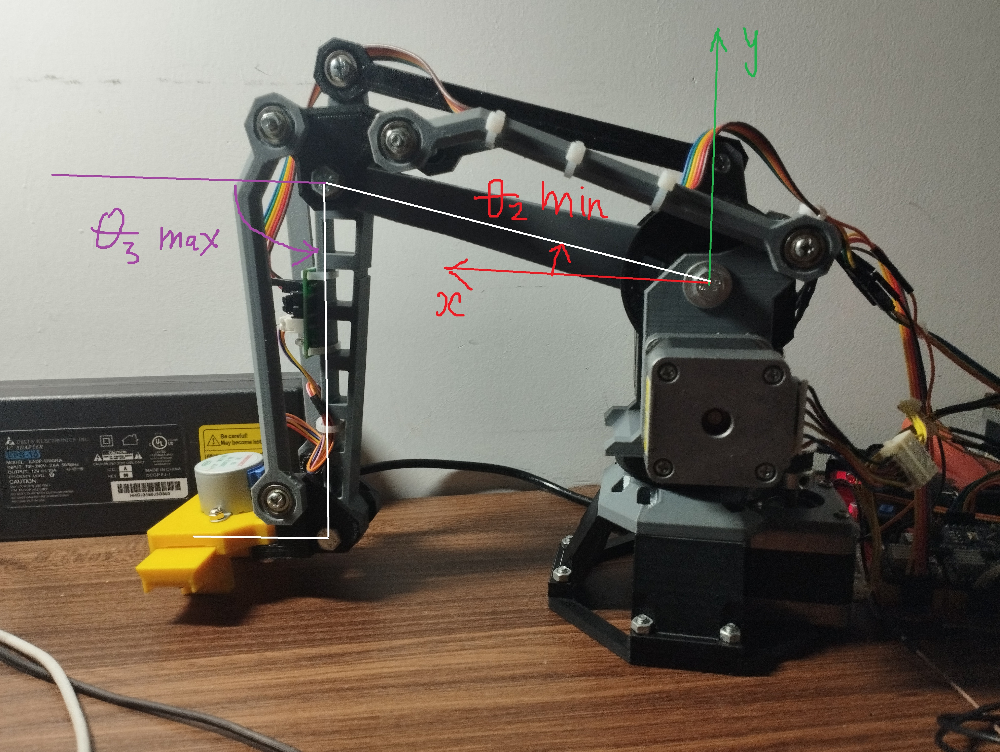
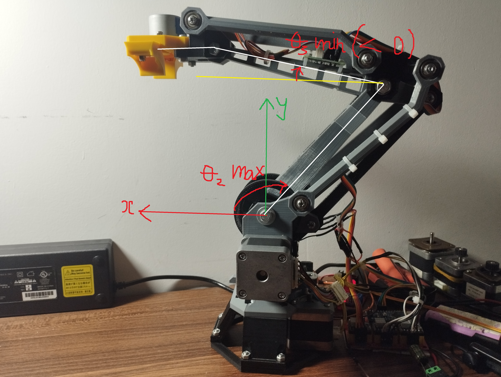
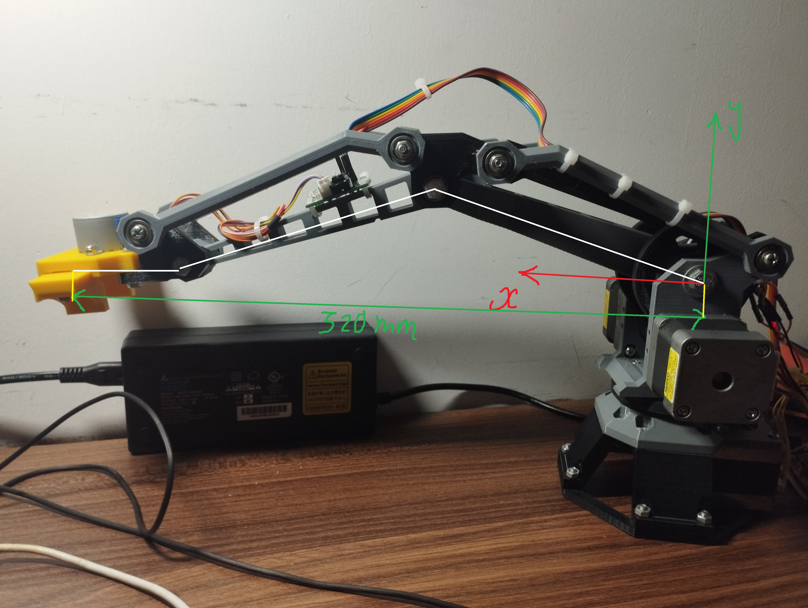

# Kinematic Model and Workspace Constraints

This document summarizes the robot arm kinematic model, sign conventions, workspace constraints, and forward/inverse kinematic equations used by firmware.

Reference implementation files:
- [firmware/RobotArm/Kinematics3D.h](firmware/RobotArm/Kinematics3D.h)
- [firmware/RobotArm/Kinematics3D.cpp](firmware/RobotArm/Kinematics3D.cpp)
- [firmware/RobotArm/Config_Robot.h](firmware/RobotArm/Config_Robot.h)

## Notation and Units

| Symbol | Meaning | Unit |
|---|---|---|
| x, y, z | Cartesian position | mm |
| L | Effective link length (both links use L) | mm |
| a | Base offset | mm |
| theta1, theta2, theta3 | Joint angles | deg in documentation, rad in computation |

## 1. Mechanical Model Used in Firmware

The physical Tobler arm uses shoulder/elbow 4-bar linkages.
For kinematic computation, firmware uses an equivalent 3-DOF model:
- base rotation joint theta1
- shoulder-equivalent joint theta2
- elbow-equivalent joint theta3
- two effective links of length L, plus base offset a

Model constants:

| Parameter | Value |
|---|---|
| L | 140.0 mm |
| a | 54.0 mm |

## 2. Home Pose and Axis Frame

Home pose:

| Joint | Value | Physical meaning |
|---|---|---|
| theta1 (base rotation) | 0 deg | Robot facing middle/front |
| theta2 (shoulder-equivalent) | 90 deg | Lower shank perpendicular to ground plane |
| theta3 (elbow-equivalent) | 0 deg | Upper shank parallel to ground plane |

The xyz axes and home geometry are shown below.

*Figure 1. Home pose and xyz axis definition.*

## 3. Positive/Negative Rotation Directions

### 3.1 Base axis (theta1)

Base rotation sign follows the base/top-view convention. The pos_z and neg_z references indicate positive and negative theta1 directions.

*Figure 2. Base reference view for theta1 rotation direction.*

*Figure 3. Top-view reference used for theta1 sign interpretation.*

*Figure 4. Positive z reference orientation.*

*Figure 5. Negative z reference orientation.*

### 3.2 Shoulder and elbow (theta2, theta3)

In side view (xy plane), positive theta2 and theta3 follow the arrow direction shown in the figure.

*Figure 6. Side-view sign convention for theta2 and theta3.*

## 4. Joint Limits

Joint limits used by kinematics:

| Joint | Range |
|---|---|
| theta1 | [-90, 90] deg |
| theta2 | [0, 130] deg |
| theta3 | [-17, 120] deg |

These limits define valid FK/IK solutions and workspace boundaries.

## 5. Forward Kinematics

Let R denote the radial projection in the xz plane:

$$
R = L\cos\theta_2 + L\cos\theta_3 + a
$$

Then:

$$
\begin{aligned}
x &= R\cos\theta_1 \\
y &= L\sin\theta_2 - L\sin\theta_3 \\
z &= R\sin\theta_1
\end{aligned}
$$

Forward kinematics is evaluated directly from the joint state.

## 6. Inverse Kinematics

### 6.1 Solve theta1 from x and z

$$
R = \sqrt{x^2 + z^2}, \quad \theta_1 = \mathrm{atan2}(z, x)
$$

### 6.2 Reduce to side-plane problem (theta2, theta3)

Define:

$$
K_1 = \frac{R-a}{L}, \quad K_2 = \frac{y}{L}
$$

Reformulate as:

$$
A\cos\theta_3 + B\sin\theta_3 = C
$$

with:

$$
A = -2K_1, \quad B = 2K_2, \quad C = -(K_1^2 + K_2^2)
$$

Then compute:

$$
\alpha = \mathrm{atan2}(B, A), \quad \phi = \arccos\left(\frac{C}{\sqrt{A^2 + B^2}}\right)
$$

$$
\theta_{3,1} = \alpha + \phi, \quad \theta_{3,2} = \alpha - \phi
$$

This yields up to two candidate elbow branches.

### 6.3 Recover theta2 and validate

For each candidate value of theta3:

$$
\cos\theta_2 = K_1 - \cos\theta_3
$$

$$
\sin\theta_2 = K_2 + \sin\theta_3
$$

$$
\theta_2 = \mathrm{atan2}(\sin\theta_2, \cos\theta_2)
$$

Both branches are evaluated, and any solution outside joint limits is rejected.

## 7. Workspace Limits

### 7.1 Axis-aligned bounds

Configured axis-aligned bounds:

| Axis | Range |
|---|---|
| X | [0, 320] |
| Z | [-320, 320] |

Y bounds are derived from joint-angle extremes.

### 7.2 Y bounds from extreme angles

$$
Y_{max} = L - L\sin(\theta_{3,min})
$$

$$
Y_{min} = L\sin(\theta_{2,min}) - L\sin(\theta_{3,max})
$$

The figure below illustrates the minimum-y boundary concept.

*Figure 7. Minimum-y workspace boundary concept.*

### 7.3 Radial reach bounds in xz projection

$$
R_{min} = L\cos(\theta_{2,max}) + L\cos(\theta_{3,min}) + a
$$

$$
R_{max} = 320
$$

Rmax is implemented as an explicit workspace cap in firmware.

The figures below illustrate the minimum and maximum radial reach boundaries.

*Figure 8. Minimum radial reach boundary.*

*Figure 9. Maximum radial reach boundary.*

## 8. Computational Workflow Summary

Kinematic computation workflow:
1. Define positive rotation directions from the geometry figures.
2. Define joint limits from mechanical constraints.
3. Map each joint angle to its motorized axis.
4. Derive forward kinematics from the geometric model.
5. Derive inverse kinematics and apply workspace/joint-limit validity checks from the same model.

This structure keeps geometric documentation and firmware implementation aligned while remaining robust to source refactoring.
